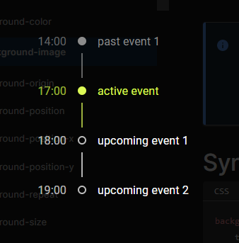

# Timeline Widget

Reads data from `public/data.json` and displays it using `@mui/lab/Timeline`

`data.json` example:

```json
{
    "items":
        [
            { "time": "14:00", "content": "past event 1" },
            { "time": "18:00", "content": "past event 2" },
            { "time": "18:30", "content": "past event 3" },
            { "time": "23:15", "content": "active event" },
            { "time": "23:45", "content": "upcoming event" }
        ]
}
```

